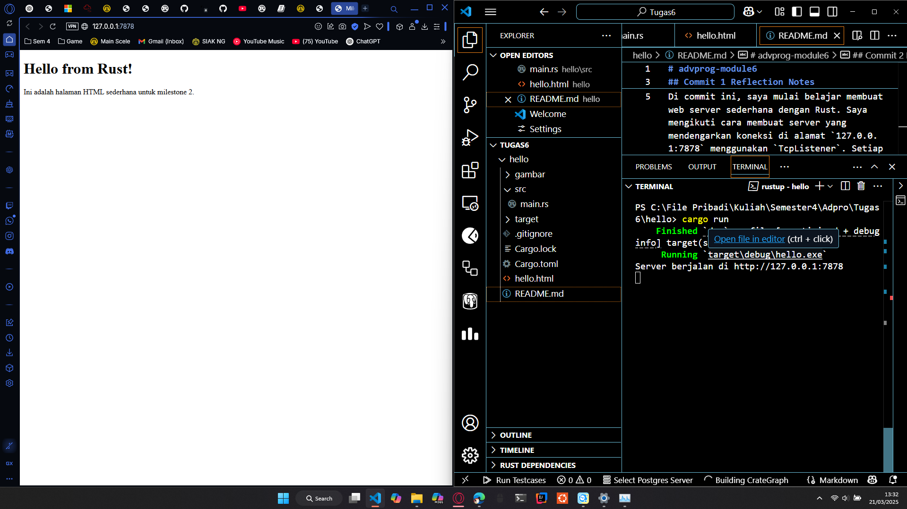

# advprog-module6

## Commit 1 Reflection Notes

Di commit ini, saya mulai belajar membuat web server sederhana dengan Rust. Saya mengikuti cara membuat server yang mendengarkan koneksi di alamat `127.0.0.1:7878` menggunakan `TcpListener`. Setiap kali ada koneksi masuk, server akan membaca data dari browser dan mencetak request yang masuk ke konsol.

Awalnya saya agak bingung dengan cara kerja stream dan buffering, tapi dengan mencoba langsung, saya belajar bahwa:
- `BufReader` membantu saya membaca data secara baris per baris.
- Fungsi `take_while` berguna untuk berhenti membaca saat header request selesai (ketika menemukan baris kosong).

Meskipun saat ini server hanya menampilkan data request, saya merasa langkah ini sudah sangat membantu saya memahami dasar komunikasi antara browser dan server.

## Commit 2 Reflection Notes
Pada milestone ini, saya belajar bagaimana cara mengirimkan file HTML sebagai respon dari web server sederhana yang ditulis dalam Rust. Secara garis besar:

- Saya membaca file hello.html menggunakan fs::read_to_string.
- Saya menetapkan header HTTP sederhana seperti HTTP/1.1 200 OK dan Content-Length.
- Saya menyusun respon lengkap berupa teks (header + isi HTML) lalu mengirimkannya ke browser.

Pada tahap ini, saya jadi lebih paham bahwa ketika browser meminta suatu halaman, server perlu mengirimkan status line, header, dan body dalam format yang sesuai protokol HTTP. Dengan begitu, browser bisa menampilkan konten HTML dengan benar. Meskipun masih sederhana, ini sudah menunjukkan alur dasar bagaimana sebuah web server menyiapkan halaman untuk peng

### Gambar Commit 2

## Commit 3 Reflection Notes
Pada milestone ini, saya belajar cara memvalidasi request dari browser dan menampilkan halaman berbeda tergantung URL yang diakses. Saya membuat file 404.html untuk menampilkan pesan apabila browser meminta path yang tidak ada. Prosesnya seperti ini:

- Membaca Baris Pertama Request
    Saya ambil baris pertama (misalnya "GET / HTTP/1.1") dan memeriksa apakah path yang diminta adalah / atau bukan.

- Menentukan Respon
    - Jika baris pertama adalah "GET / HTTP/1.1", saya mengirimkan file hello.html dengan status 200 OK.
    - Jika bukan, saya mengirimkan file 404.html dengan status 404 NOT FOUND.

- Memahami Struktur HTTP
    Saya makin paham cara kerja protokol HTTP di sisi server, bahwa setiap request bisa di-split ke dalam baris-baris, dan baris pertama umumnya berisi metode (GET/POST), path (misalnya /), dan versi protokol (HTTP/1.1).

Dengan demikian, server sederhana ini bisa menampilkan konten berbeda sesuai path yang diakses.

### Gambar Commit 3

#### Main Page
.png)

#### Error Page
.png)

## Commit 4 Reflection Notes
Pada milestone ini, saya belajar bagaimana mensimulasikan slow response di web server dengan cara menambahkan thread::sleep(Duration::from_secs(10)) sebelum mengirimkan respon. Tujuannya adalah untuk melihat apa yang terjadi jika server memproses request yang lambat.

Saat saya mengakses http://127.0.0.1:7878/sleep, browser butuh waktu 10 detik untuk menerima respon. Jika saya membuka tab baru di browser dan mencoba mengakses http://127.0.0.1:7878/ pada saat bersamaan, request kedua juga menunggu request pertama selesai. Ini menunjukkan bahwa server masih berjalan dengan konsep single-threaded. Dengan demikian, satu request yang lambat akan memblokir request lainnya.

Milestone ini membuat saya lebih memahami pentingnya concurrency dalam membangun server yang responsif.

### Gambar Commit 4

#### Page saat Sleep
.png)

#### Page normal
.png)

## Commit 5 Reflection Notes
Pada milestone ini, saya belajar membuat web server multithreaded di Rust dengan pendekatan thread pool. Perbedaannya dengan versi single-threaded:

- Enum Message:
    Saya menambahkan enum untuk membedakan job baru (NewJob(Job)) dan perintah Terminate. Ketika ThreadPool di-drop, saya mengirimkan Message::Terminate ke semua worker agar mereka menghentikan loop-nya.

- Memanggil .join() di Drop:
    Dengan memanggil .join() pada setiap worker, saya memastikan semua thread ditutup secara rapi. Ini juga menghilangkan pesan peringatan tentang field thread yang tidak digunakan, karena sekarang saya benar-benar “membaca” (menjalankan) JoinHandle-nya.

- Concurrency Lebih Baik:
    Sekarang, request lambat (misalnya /sleep) tidak memblokir request lain, karena ada beberapa thread siap bekerja paralel. Ini meningkatkan responsiveness server.

Saya merasa milestone ini sangat membantu memahami cara kerja concurrency di Rust dan bagaimana Rust menangani ownership dan thread safety. Dengan adanya thread pool, server menjadi lebih efisien saat menangani banyak request secara bersamaan.

### Gambar Commit 5

#### Page banyak
.png)

#### Page normal
.png)